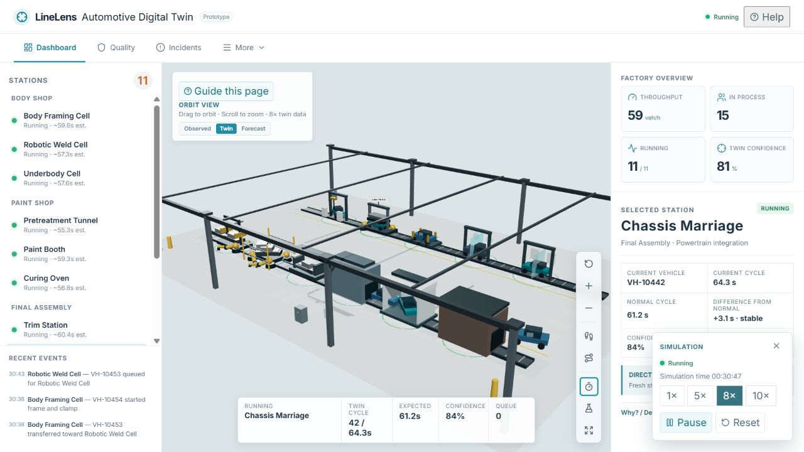
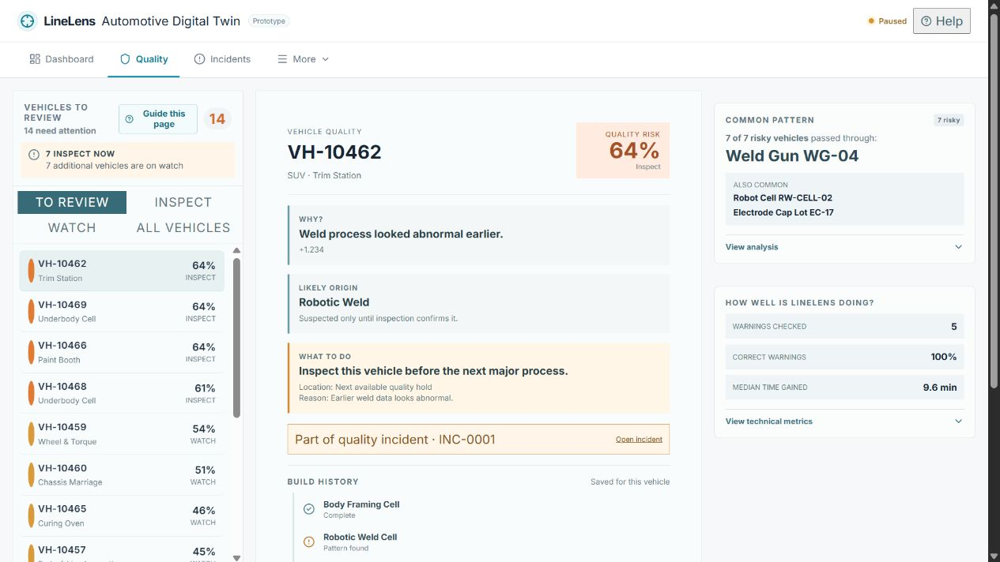
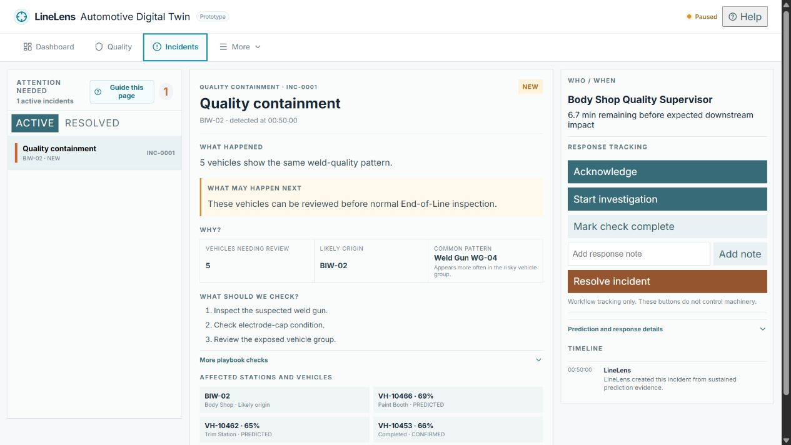
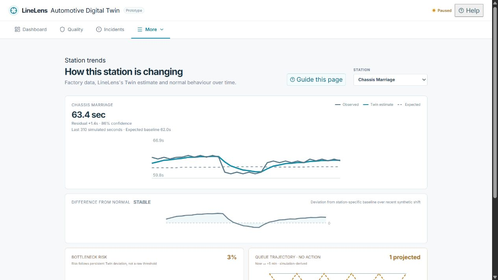
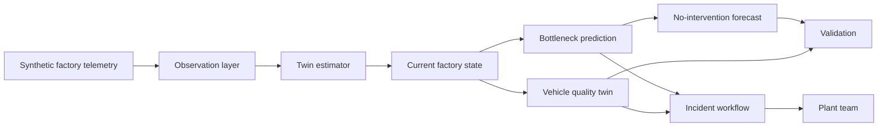

# LineLens

**See problems earlier. Trace quality issues faster.**



LineLens is a digital twin for vehicle assembly lines. It combines uneven factory data into an evolving view of production, predicts how developing bottlenecks may affect the line, tracks vehicle-level quality risk, identifies shared upstream patterns, and turns important warnings into human-led incidents.

This is a working prototype for the Accenture Innovation Challenge 2026. Its data is synthetic by design: LineLens demonstrates a transparent decision-support method and never represents a connection to a real plant or control system.

## The Problem

Assembly teams often have fragmented station data, late quality findings, and limited time to see how a small slowdown may spread. A useful digital twin must make the current situation understandable, explain uncertainty, connect a vehicle to its build history, and give people evidence before they decide what to investigate.

## The LineLens Approach

LineLens models an 11-station automotive line across Body Shop, Paint Shop, and Final Assembly. It:

- keeps an updated Twin estimate even when sensor coverage is limited;
- detects persistent station slowdowns rather than reacting to a single unusual cycle;
- runs a no-intervention forecast to show likely queue, starvation, and throughput effects;
- maintains a vehicle Digital Build Record with station, tool, lot, and process evidence;
- identifies common factors shared by risky vehicles without claiming automatic root cause; and
- brings meaningful warnings into an incident workflow where the plant team remains in control.

## Product Tour

The in-product **Full Product Tour** tells the complete LineLens story in about five minutes, from factory view to station evidence, forecast, incident response, vehicle quality, common patterns, and validation. It uses the real local simulation pipelines and can be closed at any time.

Each major workspace also has a focused **Guide this page** walkthrough.

## Screenshots

| Factory overview | Quality investigation |
|---|---|
|  |  |

| Incident response | Station trends |
|---|---|
|  |  |

## Architecture



Read the [architecture](docs/architecture.md), [validation method](docs/validation.md), and [prototype assumptions](docs/prototype-assumptions.md) for product-focused detail.

## Key Capabilities

### Factory Twin and Confidence

The Dashboard differentiates between **Observed** telemetry, the current **Twin** estimate, and a **Forecast**. Confidence is shown close to the evidence it describes. The viewport includes Orbit, immersive Walk Mode, and Factory Flythrough.

### Early Bottleneck Prediction

The prediction service examines persistent cycle-time deviation, queue behaviour, takt pressure, and completion-rate changes. Forecasts use a disposable copy of the current Twin state and report real computed outputs from the local simulator.

### Vehicle Quality Intelligence

LineLens maintains vehicle build history and produces inspection risk before End-of-Line confirmation. When several risky vehicles share a tool, cell, or lot, the Common Pattern view identifies the lead for engineering investigation—never a confirmed root cause.

### Human-Led Incidents

Incidents gather what happened, expected impact, evidence, affected assets and vehicles, recommended checks, owner, and response window. Acknowledge, investigate, note, and resolve actions record workflow only; they do not control equipment.

## Run Locally

Prerequisites: Python 3.11+, Node.js 20+, and npm.

```bash
# terminal 1
cd backend
python -m venv .venv
.venv\Scripts\activate          # Windows
pip install -r requirements.txt
uvicorn app.main:app --host 127.0.0.1 --port 8102

# terminal 2
cd frontend
npm install
npm run dev
```

Open the local Vite URL. The frontend proxies `/api` to the backend on port 8102.

## Validation and Tests

```bash
# from the repository root
python -m pytest backend/tests -v

# from frontend
npm run build
npm run test:tour
```

The backend suite covers Twin estimation, bottleneck forecasting, vehicle quality, incident lifecycle, and tour/demo scenarios. The frontend build includes TypeScript checking.

## Repository Structure

```text
backend/       FastAPI simulation, Twin, prediction, quality, and incidents
frontend/      React + Three.js product interface
assets/        Release screenshots
demo/          Final prototype walkthrough video
docs/          Public product documentation
```

## Prototype Assumptions

- All operating data and outcomes are synthetic.
- The factory topology is representative, not a specific plant.
- Prediction and quality outputs are prototype decision-support signals.
- People decide what to investigate and act on; LineLens is read-only by design.

## License and Attribution

Licensed under [CC BY-NC 4.0](LICENSE). See [ATTRIBUTIONS.md](ATTRIBUTIONS.md) for third-party library and design attribution.
