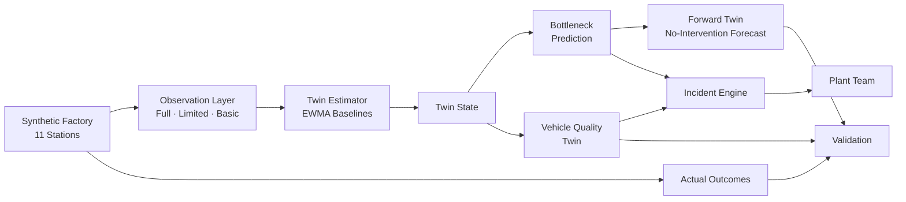

# LineLens

**See problems earlier. Trace quality issues faster.**

LineLens is an evolving digital twin for automotive assembly lines. It helps
plant teams understand what is happening now, see where a problem may spread
next, trace quality risks across vehicles, and respond earlier — even when
some machines have limited sensor data.

Built as a working prototype for the
[Accenture Innovation Challenge 2026 — DigitalTwin.ai](https://www.accenture.com).

<!-- Hero screenshot: assets/dashboard-overview.png -->

---

## Prototype Demo

<!-- Video: demo/LineLens_Prototype_Demo.mp4 — will be added before final submission -->

---

## What LineLens Does

### Live Factory Twin

LineLens maintains a live digital model of an 11-station automotive assembly
line. Vehicles move through Body Shop, Paint Shop, and Final Assembly. Each
station learns its own healthy operating fingerprint and continuously compares
current behavior against that baseline.

Not every station has the same instrumentation. LineLens works with three
levels of sensor coverage — full telemetry, limited telemetry, and basic
signals — and makes clear how confident each estimate is.

### Early Bottleneck Warning

When a station starts slowing beyond its normal range, LineLens raises a
bottleneck risk score based on persistent deviation, takt pressure, queue
growth, and completion-rate changes. Each risk assessment includes the specific
evidence behind it.

### Forward Prediction

A disposable copy of the current twin state runs forward in simulated time
to show what would happen if nothing changes. The forecast view shows expected
queue growth, upstream blocking, downstream starvation, and throughput impact
at +2, +5, +10, and +15 minute horizons.

### Vehicle Quality Twin

Every vehicle carries a digital build record — which station, tool, batch,
and conditions it passed through. LineLens uses this record to predict quality
risk before the vehicle reaches end-of-line inspection.

When multiple risky vehicles share a common upstream factor (same weld tool,
same equipment batch), LineLens identifies the shared pattern so the quality
team knows where to look first.

### Incident Response

Production bottleneck warnings and vehicle quality concerns are consolidated
into structured incidents with evidence, affected assets, affected vehicles,
recommended checks, and a human workflow (acknowledge → investigate → resolve).
Incidents are decision-support tools — they never write to PLCs, stop machines,
or alter the physical process.

### Built-In Validation

LineLens compares its predictions against actual outcomes. Bottleneck forecasts
are validated at +2, +5, and +10 minute checkpoints. Quality predictions are
validated against synthetic inspection results. The About / Validation panel
reports prediction lead time, forecast accuracy, and quality detection metrics.

### Guided Tour

A 7-step spotlight walkthrough introduces the product in under 90 seconds:
live factory → sensor gaps → early warning → future impact → vehicle history →
common patterns → incident response.

---

## Architecture



See [docs/architecture.md](docs/architecture.md) for detailed technical documentation.

---

## Station Topology

| ID | Station | Shop | Process | Sensor Coverage |
|---|---|---|---|---|
| BIW-01 | Body Framing Cell | Body Shop | Frame and clamp | Full |
| BIW-02 | Robotic Weld Cell | Body Shop | Spot welding | Full |
| BIW-03 | Underbody Cell | Body Shop | Underbody joining | Limited |
| PAINT-01 | Pretreatment Tunnel | Paint Shop | Surface preparation | Basic |
| PAINT-02 | Paint Booth | Paint Shop | Base coat application | Full |
| PAINT-03 | Curing Oven | Paint Shop | Thermal cure | Limited |
| FA-01 | Trim Station | Final Assembly | Interior trim | Basic |
| FA-02 | Chassis Marriage | Final Assembly | Powertrain integration | Full |
| FA-03 | Wheel & Torque | Final Assembly | Wheel fastening | Full |
| FA-04 | ADAS Calibration | Final Assembly | Sensor calibration | Full |
| FA-05 | End-of-Line Inspection | Final Assembly | Final functional test | Limited |

Two accumulation buffers separate the shops: **Body Shop Exit Accumulator**
(Underbody → Pretreatment, capacity 4) and **Painted Body Storage**
(Curing Oven → Trim, capacity 5).

Sensor coverage is intentionally uneven. This is a design choice — real plants
have mixed instrumentation, and LineLens demonstrates that useful estimation
and prediction can work with incomplete data.

---

## Tech Stack

| Layer | Technology |
|---|---|
| 3D Visualization | Three.js via React Three Fiber |
| Frontend | React 18 · TypeScript · Vite |
| UI Icons | Lucide React |
| Backend API | FastAPI · Python 3.11+ |
| Simulation | NumPy · pandas |
| Quality Model | scikit-learn |
| Testing | pytest · Node test runner |

---

## Running Locally

### Prerequisites

- **Python 3.11+**
- **Node.js 20+**
- **npm**

### Backend

```bash
cd backend
python -m venv .venv

# Windows
.venv\Scripts\activate

# macOS / Linux
source .venv/bin/activate

pip install -r requirements.txt
uvicorn app.main:app --host 127.0.0.1 --port 8102
```

The API will be available at `http://127.0.0.1:8102`.

### Frontend

```bash
cd frontend
npm install
npm run dev
```

The application will be available at `http://localhost:5176`.

The Vite dev server proxies `/api` requests to the backend at port 8102.

### Verify

Open `http://localhost:5176` in a browser. You should see the 3D factory
with vehicles moving through stations. The twin synchronization indicator
in the header shows the current estimation confidence.

---

## Testing

### Backend

```bash
# Run from the repository root (tests import from backend.app)
python -m pytest backend/tests/ -v
```

The test suite contains 48 tests covering twin estimation, bottleneck
prediction, vehicle quality, incident lifecycle, and guided tour scenarios.

### Frontend

```bash
cd frontend
npm run build
```

Verifies TypeScript compilation and production build.

---

## Repository Structure

```
LineLens/
├── README.md
├── LICENSE
├── .gitignore
├── ATTRIBUTIONS.md
│
├── frontend/
│   ├── src/
│   │   ├── App.tsx              # Main application
│   │   ├── GuidedTour.tsx       # Tour spotlight component
│   │   ├── twin/
│   │   │   └── FactoryScene.tsx # 3D factory scene
│   │   ├── api.ts               # API client
│   │   ├── tour.ts              # Tour step definitions
│   │   ├── types.ts             # TypeScript interfaces
│   │   ├── styles.css           # Application styles
│   │   └── main.tsx             # Entry point
│   ├── index.html
│   ├── package.json
│   ├── vite.config.ts
│   └── tsconfig.json
│
├── backend/
│   ├── app/
│   │   ├── main.py              # FastAPI endpoints
│   │   ├── models.py            # Pydantic data models
│   │   ├── simulation.py        # Production line simulator
│   │   ├── twin/
│   │   │   └── estimator.py     # Evolving twin estimator
│   │   ├── prediction/
│   │   │   ├── service.py       # Bottleneck prediction
│   │   │   ├── risk.py          # Risk scoring model
│   │   │   ├── forward.py       # Forward twin simulator
│   │   │   ├── snapshot.py      # Twin state snapshot
│   │   │   └── models.py        # Prediction data models
│   │   ├── quality/
│   │   │   ├── service.py       # Quality twin service
│   │   │   ├── model.py         # Quality prediction model
│   │   │   ├── features.py      # Feature extraction
│   │   │   ├── genealogy.py     # Common factor analysis
│   │   │   └── quality_model_artifact.json
│   │   └── incidents/
│   │       ├── service.py       # Incident management
│   │       ├── playbooks.py     # Response playbook definitions
│   │       └── models.py        # Incident data models
│   ├── tests/
│   └── requirements.txt
│
├── docs/
│   ├── architecture.md
│   ├── demo-guide.md
│   ├── prototype-assumptions.md
│   ├── validation.md
│   ├── guided-tour.md
│   └── GITHUB_RELEASE_CHECKLIST.md
│
├── assets/                      # Screenshots (added before release)
└── demo/                        # Prototype demo video (added before release)
```

---

## Prototype Assumptions

LineLens is a working prototype, not a production deployment.

- All data is **synthetic** — generated by the built-in simulation engine
- The factory topology is **representative** — 11 stations covering realistic
  automotive processes, not a specific real plant
- Prediction models are **interpretable weighted scoring**, calibrated for
  prototype demonstration scenarios
- The quality model artifact is trained on **synthetic ground truth**
- LineLens is **decision support** — it shows evidence and predictions;
  humans decide what to do

See [docs/prototype-assumptions.md](docs/prototype-assumptions.md) for details.

---

## Documentation

| Document | Description |
|---|---|
| [Architecture](docs/architecture.md) | Technical architecture: factory, observation layer, twin estimator, prediction, quality, incidents |
| [Demo Guide](docs/demo-guide.md) | Step-by-step instructions for demonstrating each capability |
| [Prototype Assumptions](docs/prototype-assumptions.md) | Synthetic data, simplifications, and scope boundaries |
| [Validation](docs/validation.md) | Prediction-vs-actual validation methodology |
| [Guided Tour](docs/guided-tour.md) | 7-step spotlight walkthrough for first-time users |

---

## Challenge Alignment

| DigitalTwin.ai Criterion | LineLens Approach |
|---|---|
| **Digital Twin** | Evolving state estimator that learns per-station baselines and adapts to sensor gaps |
| **Predictive Analytics** | Bottleneck risk scoring with interpretable evidence; forward no-intervention forecast |
| **Quality Intelligence** | Per-vehicle quality twin with digital build record and common factor analysis |
| **Human-in-the-Loop** | Structured incidents with evidence, checks, and workflow — never autonomous |
| **Validation** | Built-in prediction-vs-actual comparison with measured lead times |
| **Scalability Path** | Station topology defined in a single SPECS array; architecture supports extension |
| **Mixed Data Maturity** | Three sensor tiers with explicit confidence; works with incomplete instrumentation |

---

## License

[CC BY-NC 4.0](LICENSE) — See [ATTRIBUTIONS.md](ATTRIBUTIONS.md) for
third-party library licenses and design reference attribution.
