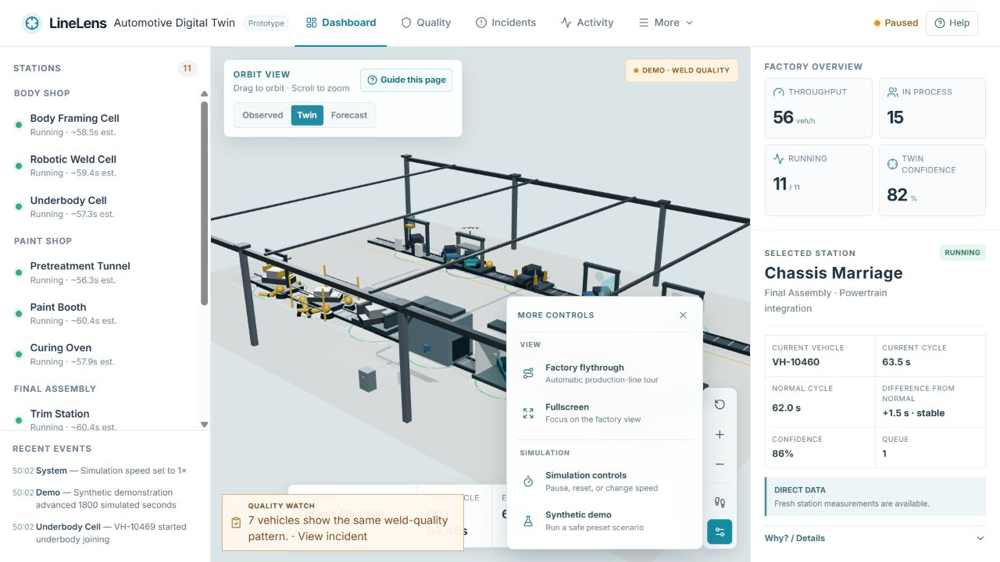
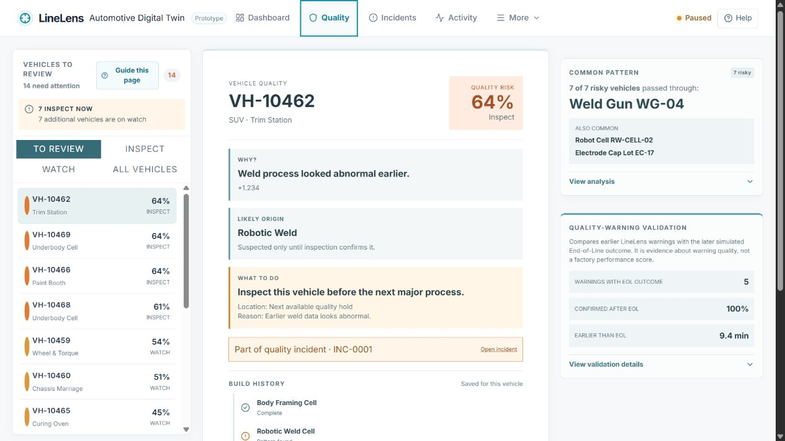
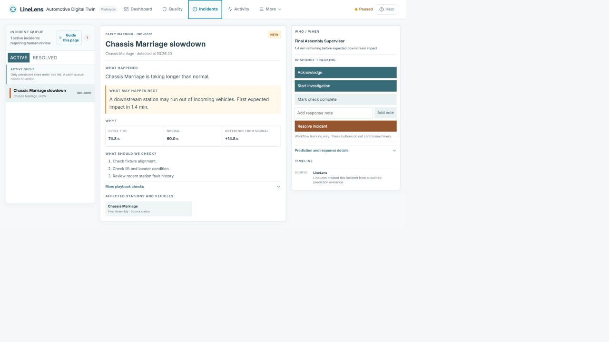
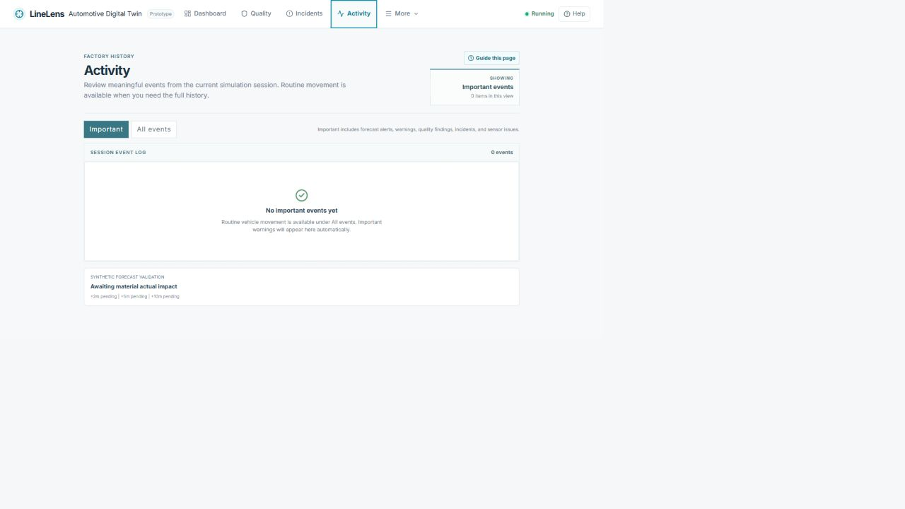
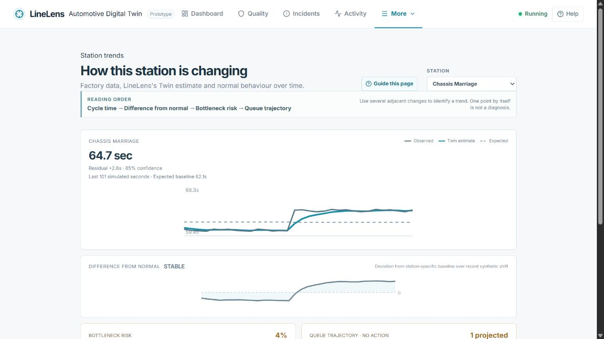
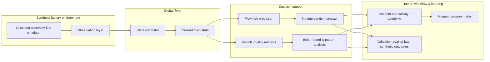

# LineLens

**An evidence-first automotive digital twin prototype.**

LineLens helps a production team see a developing flow or quality problem earlier, understand the evidence behind it, and organise a human response. It is a working prototype created for the Accenture Innovation Challenge 2026.



> **Prototype boundary:** Every signal, vehicle, process variation, and outcome in this repository is synthetic. LineLens is decision support only: it does not connect to a plant, PLC, MES, or factory equipment, and it never issues control commands.

## The problem

In an assembly line, a small change can be hard to interpret until it becomes a larger disruption. Station data can be incomplete, a queue can develop slowly, and a quality issue may only be visible after end-of-line inspection. The result is a familiar operational gap: teams have information, but not always the context needed to decide where to investigate first.

LineLens brings that context together. It keeps a current estimate of the line, compares current behaviour with a learned normal baseline, projects a no-intervention outcome, traces quality evidence to individual vehicles, and records the team’s response without taking action on its behalf.

## What you can do in LineLens

| Workspace | Purpose | What it deliberately does not claim |
| --- | --- | --- |
| **Dashboard** | Inspect the 11-station factory, select a station, compare current cycle with normal behaviour, and review confidence. | A connection to a live plant or universal sensor coverage. |
| **Stations** | Compare every station’s direct evidence, Twin estimate, normal cycle, residual, and confidence in one consistent view. | That indirect evidence is the same as a direct sensor measurement. |
| **Trends** | Compare observed data, the Twin estimate, normal behaviour, residuals, and bottleneck risk over time. | That one unusual point proves a fault. |
| **Quality** | Prioritise vehicles for inspection, follow a Digital Build Record, and identify a shared tool, cell, or lot worth checking. | A confirmed defect or root cause before an engineering check. |
| **Incidents** | Turn persistent, material risks into an evidence-led response workflow with notes and ownership. | Automatic machine intervention or automatic resolution. |
| **Activity** | Review the current simulation session’s important or complete event history in time order. | An audit record for a live factory or a persistent database. |
| **Validation** | Compare predictions with later synthetic outcomes when those outcomes become available. | Real-plant calibration or performance guarantees. |

## A practical product story

1. **See the line.** Start on Dashboard and choose a station that looks different from normal.
2. **Understand the evidence.** Compare the current cycle, normal cycle, queue, and confidence before judging a change.
3. **Look ahead.** Use Forecast and Trends to understand whether the difference is persistent and what may happen if nothing changes.
4. **Trace quality.** Open Quality to review a vehicle’s build evidence and any shared pattern across a risky cohort.
5. **Keep people in control.** Use Incidents to document acknowledgement, investigation, checks, notes, and resolution.

The built-in **Help & guidance** panel provides a five-minute product tour and focused guides for Dashboard, Quality, Incidents, Activity, Stations, and Trends. The top-bar **Demo** button opens synthetic scenarios; **Simulation** opens pause, speed, and reset controls. Fullscreen is available directly on the factory control rail.

## Live product captures

These screenshots were captured from a locally running LineLens application using synthetic simulation data. They are representative product captures; control placement may differ as the interface is refined.

| Factory overview | Quality monitoring |
| --- | --- |
|  |  |

| Incident workspace | Activity history |
| --- | --- |
|  |  |

| Station trends |
| --- |
|  |

## How it works


```mermaid
flowchart LR
    subgraph Factory["Synthetic factory environment"]
      A["11-station assembly-line simulator"] --> B["Observation layer"]
    end
    subgraph Twin["Digital Twin"]
      C["State estimator"] --> D["Current Twin state"]
    end
    subgraph Insight["Decision support"]
      E["Flow-risk prediction"] --> F["No-intervention forecast"]
      G["Vehicle quality analysis"] --> H["Build-record & pattern analysis"]
    end
    subgraph Human["Human workflow & learning"]
      I["Incident and activity workflow"] --> J["Human decision maker"]
      K["Validation against later synthetic outcomes"]
    end
    B --> C
    D --> E
    D --> G
    F --> I
    H --> I
    F --> K
    H --> K
```

| Layer | Runs in this repository | Professional boundary |
| --- | --- | --- |
| **Synthetic factory** | An in-memory, 11-station line across Body Shop, Paint Shop, and Final Assembly. | It represents a factory; it is not a plant connection. |
| **Observation layer** | Direct, limited, and basic synthetic signals with different levels of available detail. | The Twin works from observations rather than presenting hidden simulator truth as telemetry. |
| **Twin state** | Station baselines, estimated cycle behaviour, queues, operational state, and confidence. | Confidence communicates the strength of evidence; it is not a guarantee. |
| **Decision support** | Flow-risk, no-intervention forecasts, vehicle-quality risk, and common-pattern analysis. | Signals prioritise investigation; they do not diagnose root cause or trigger action. |
| **Human workflow and validation** | Incidents, activity history, response notes, and comparisons with later synthetic outcomes. | The system records and explains; people decide and act. |

The backend exposes simulated observations to the Twin estimator. The React and Three.js frontend turns that state into Observed, Twin, Forecast, Quality, Incidents, Activity, and Trends workspaces.

For technical detail, read the [architecture](docs/architecture.md), [validation method](docs/validation.md), and [prototype assumptions](docs/prototype-assumptions.md).

## Run locally

### Requirements

- Python 3.11 or newer
- Node.js 24 or newer and npm (the tour tests import TypeScript directly)
- Git

No environment variables, external services, database, or API keys are required for the local prototype.

### 1. Clone the repository

```bash
git clone https://github.com/amn1704/LineLens-DigitalTwin.git
cd LineLens-DigitalTwin
```

### 2. Start the backend

Open a first terminal at the repository root.

```bash
cd backend
python -m venv .venv

# Windows PowerShell
.venv\Scripts\Activate.ps1

# macOS / Linux
# source .venv/bin/activate

python -m pip install --upgrade pip
python -m pip install -r requirements.txt
uvicorn app.main:app --host 127.0.0.1 --port 8102
```

The API is then available at `http://127.0.0.1:8102`, with interactive API documentation at `http://127.0.0.1:8102/docs`.

### 3. Start the frontend

Open a second terminal at the repository root.

```bash
cd frontend
npm ci
npm run dev
```

Open the local URL printed by Vite (normally `http://127.0.0.1:5173`). The Vite development server proxies `/api` requests to the backend on port `8102`.

### 4. Verify the installation

From the repository root, with the backend virtual environment active:

```bash
python -m pip install -r backend/requirements-dev.txt
python -m pytest backend/tests -v
```

Then, from `frontend/`:

```bash
npm run test:tour
npm run build
```

The frontend build performs TypeScript checking before creating the production bundle. The backend tests cover the simulated Twin, flow prediction, quality workflow, incidents, and demonstration scenarios.

## Using the prototype

- **Start with Dashboard.** A calm factory is a valid result, not a missing result.
- **Select a station** to review the relevant current cycle, normal baseline, queue, and confidence together.
- **Use Trends** when you need to determine whether a change persists instead of reacting to one point.
- **Use Quality** to review a vehicle’s evidence before deciding on extra inspection.
- **Use Incidents** when the simulator raises a persistent risk that merits a documented human response.
- **Use Demo scenarios carefully.** They introduce synthetic conditions for a demonstration only and affect no external system.

## Honest limitations

- The factory is a simplified linear 11-station model, not a representation of a named plant.
- All state is held in memory; restarting the backend resets the simulated line, vehicle records, and validation history.
- Prediction thresholds and quality behaviour are tuned for the synthetic prototype, not calibrated with real production labels.
- Confidence is a prototype indicator based on available evidence, freshness, and sensor maturity; it is not a calibrated probability interval.
- The project has not been benchmarked for a full-scale plant or high-frequency production telemetry.

## Repository structure

```text
LineLens-DigitalTwin/
├── backend/
│   ├── app/
│   │   ├── main.py                    # FastAPI application and HTTP endpoints
│   │   ├── models.py                  # Shared simulation and observation models
│   │   ├── simulation.py              # Synthetic automotive assembly line
│   │   ├── twin/                      # State estimation and station baselines
│   │   ├── prediction/                # Flow risk and forward simulation
│   │   ├── quality/                   # Vehicle evidence, model, and genealogy
│   │   │   └── quality_model_artifact.json  # Required versioned model parameters
│   │   └── incidents/                 # Human response workflow and playbooks
│   ├── tests/
│   │   ├── test_twin_estimator.py
│   │   ├── test_prediction.py
│   │   ├── test_quality.py
│   │   ├── test_incidents.py
│   │   └── test_demo.py
│   ├── requirements.txt              # Application dependencies
│   └── requirements-dev.txt          # Application dependencies plus pytest
├── frontend/
│   ├── src/
│   │   ├── App.tsx                   # Workspaces and application controls
│   │   ├── GuidedTour.tsx            # Tour and page-guide interface
│   │   ├── tour.ts                   # Guide content and progress helpers
│   │   ├── api.ts                    # Backend requests
│   │   ├── types.ts                  # Shared frontend types
│   │   ├── main.tsx                  # React entry point
│   │   ├── styles.css                # Application styles
│   │   └── twin/FactoryScene.tsx      # Interactive Three.js factory
│   ├── tests/tour.test.mjs
│   ├── index.html
│   ├── package.json
│   ├── package-lock.json             # Reproducible npm dependency resolution
│   ├── tsconfig.json
│   ├── tsconfig.node.json
│   └── vite.config.ts                # Development proxy and frontend build
├── docs/
│   ├── images/                       # Five product screenshots used above
│   ├── architecture.md
│   ├── demo-guide.md
│   ├── guided-tour.md
│   ├── prototype-assumptions.md
│   └── validation.md
├── .gitignore
├── ATTRIBUTIONS.md
├── LICENSE
└── README.md
```

Package initializer files (`__init__.py`) are omitted from this overview. Tests, technical documentation, attribution, and model parameters are retained because they support verification, maintenance, and use of the project.

Local development creates `backend/.venv/`, `frontend/node_modules/`, `frontend/dist/`, and Python/test caches. These are ignored by Git and are not part of the source distribution. Keep private notes, exports, and one-off experiments outside the project; keep reusable checks in the test folders. Do not remove `package-lock.json` or the quality model artifact when preparing a clone for another system.

## License and attribution

LineLens is licensed under [CC BY-NC 4.0](LICENSE). See [ATTRIBUTIONS.md](ATTRIBUTIONS.md) for third-party library and design attribution.
