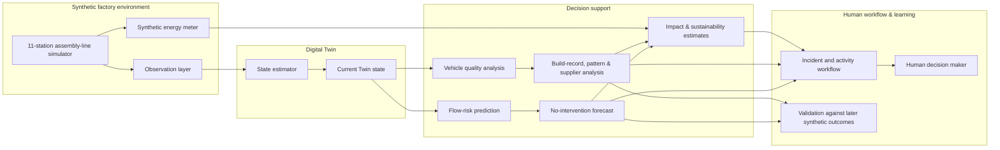

# LineLens: an explainable digital twin for smarter, greener automotive assembly

*Built for the Maruti Suzuki Innovation Hackathon 2026 (IIMCIP) · Focus domain: Manufacturing & Industrial Innovation.*

> Independent student concept for the Maruti Suzuki Innovation Hackathon 2026. Not affiliated with or endorsed by Maruti Suzuki India Ltd. No Maruti Suzuki data is used.

LineLens helps a production team see a developing flow or quality problem earlier, understand the evidence behind it, see what doing nothing would cost in vehicles, ₹ and kWh, and organise a human response.


> **Prototype boundary:** Every signal, vehicle, process variation, and outcome in this repository is synthetic. Every ₹, vehicles-at-risk, and kWh figure is an assumption-based estimate built from that synthetic data and illustrative placeholder values, which you can edit in the app. LineLens is decision support only: it does not connect to a plant, PLC, MES, or factory equipment, and it never issues control commands.

## Why this matters for Indian automotive manufacturing

- **High-volume, mixed-model lines.** When several body styles and powertrains share one line, a few seconds lost at one station repeat every cycle. Small takt losses compound across a shift and across shifts.
- **Brownfield plants with mixed sensor maturity.** Modern robot cells often sit beside legacy conveyors that report little more than arrival and departure. LineLens models this directly with **Full**, **Limited**, and **Basic** sensor tiers. It estimates every station and shows how confident each estimate is, instead of hiding the gaps.
- **A large Tier-1 / Tier-2 supplier base.** A defective consumable lot can reach many vehicles before End-of-Line inspection finds the first one. LineLens traces risky bodies back to the shared tool, lot, and supplier while they are still on the line.
- **Rising energy cost and CO₂ commitments.** Thermal processes such as paint and curing keep drawing power when they are starved or blocked. That idle energy is a hidden cost of every flow disruption.
- **Supervisor-led shop floors.** Warnings come with evidence, a playbook, and response tracking. A supervisor decides what to do; LineLens never acts on the line.
- **Low-risk adoption.** The design is read-only beside existing systems, so a pilot can start without touching control logic.

## Domain fit

| Sub-topic | How LineLens covers it |
| --- | --- |
| **Smart manufacturing** | A live Twin state estimator with explicit confidence, an interpretable bottleneck-risk score, and a no-intervention Forward Twin forecast at +2, +5, +10, and +15 minutes. |
| **Industry 4.0** | A Digital Build Record (digital thread) for every vehicle, an observation layer across Full / Limited / Basic sensor tiers, and a read-only integration path (OPC UA / MQTT) in the pilot plan. |
| **Process improvement** | Incidents with playbooks and response tracking, quality-genealogy leads (weld gun, electrode-cap lot, Tier-2 supplier), assumption-based vehicles and ₹ at risk, and validation of predictions against later outcomes. |
| **Sustainability** | A synthetic per-station energy meter, kWh per vehicle, idle-energy share, CO₂ with a configurable grid factor, idle energy at risk from a forecast bottleneck, and rework avoided by catching defects in-line. |

## How LineLens differs from commercial digital-twin suites

Commercial suites are strong at detailed engineering simulation and plant design. LineLens targets a different gap: daily operational decisions on an existing line.

- **Works with incomplete and legacy signals.** Every estimate carries explicit confidence, and stations with only basic signals are estimated rather than left blank.
- **Lightweight and low-cost to pilot.** It runs on a laptop or as one Docker image, with no database, licence, or plant integration needed to evaluate it.
- **Explainable models instead of black-box ML.** Bottleneck risk is a weighted logistic score over named features. The quality model is a small logistic regression that reports feature contributions. Genealogy uses simple enrichment against a baseline.
- **Built-in validation of its own predictions.** Forecasts and quality warnings are compared with later outcomes, and misses and false alarms stay visible.

## The problem

In an assembly line, a small change can be hard to interpret until it becomes a larger disruption. Station data can be incomplete, a queue can develop slowly, and a quality issue may only be visible after end-of-line inspection. The result is a familiar operational gap: teams have information, but not always the context needed to decide where to investigate first, or a sense of what waiting will cost.

LineLens brings that context together. It keeps a current estimate of the line, compares current behaviour with a learned normal baseline, projects a no-intervention outcome, translates that outcome into vehicles, ₹, and kWh, traces quality evidence to individual vehicles and suppliers, and records the team’s response without taking action on its behalf.

## What you can do in LineLens

| Workspace | Purpose | What it deliberately does not claim |
| --- | --- | --- |
| **Dashboard** | Inspect the 11-station factory, select a station, compare current cycle with normal behaviour, and review confidence. Factory overview adds **Energy / vehicle** and **Value at risk / shift**; the **Energy & CO₂** card shows idle-energy share, the top idle-energy station, and CO₂ so far. | A connection to a live plant, universal sensor coverage, or measured energy. |
| **Stations** | Compare every station’s direct evidence, Twin estimate, normal cycle, residual, and confidence in one consistent view. | That indirect evidence is the same as a direct sensor measurement. |
| **Trends** | Compare observed data, the Twin estimate, normal behaviour, residuals, and bottleneck risk over time. | That one unusual point proves a fault. |
| **Quality** | Prioritise vehicles for inspection, follow a Digital Build Record, and identify a shared tool, cell, lot, or synthetic Tier-2 supplier worth checking, with the rework that catching flagged bodies in-line could avoid. | A confirmed defect or root cause before an engineering check. |
| **Incidents** | Turn persistent, material risks into an evidence-led response workflow with notes and ownership. Each open incident shows **Impact if nothing changes**. | Automatic machine intervention or automatic resolution. |
| **Activity** | Review the current simulation session’s important or complete event history in time order. | An audit record for a live factory or a persistent database. |
| **Validation** | Compare predictions with later synthetic outcomes when those outcomes become available. | Real-plant calibration or performance guarantees. |
| **Impact assumptions** (More menu) | Edit the illustrative shift length, contribution margin, rework costs, tariff, and grid emission factor behind every ₹ and CO₂ figure. | That the defaults are real OEM or plant figures. |

## A practical product story

1. **See the line.** Start on Dashboard and choose a station that looks different from normal.
2. **Understand the evidence.** Compare the current cycle, normal cycle, queue, and confidence before judging a change.
3. **Look ahead.** Use Forecast and Trends to understand whether the difference is persistent and what may happen if nothing changes.
4. **Know the cost.** Read vehicles and ₹ at risk per shift, idle energy at risk, and rework avoidable in-line. Each figure is an assumption-based estimate you can edit.
5. **Trace quality.** Open Quality to review a vehicle’s build evidence and any shared pattern, down to the consumable lot and its supplier.
6. **Keep people in control.** Use Incidents to document acknowledgement, investigation, checks, notes, and resolution.

The top bar’s **Pitch demo** button resets the synthetic line and runs a three-minute, nine-step presenter story (see [the pitch script](docs/hackathon/PITCH-SCRIPT.md)). **Help & guidance** provides the full five-minute product tour and focused guides for Dashboard, Quality, Incidents, Activity, Stations, and Trends. **Demo** opens the individual synthetic scenarios; **Simulation** opens pause, speed, and reset controls.

## How the impact and sustainability numbers are made

Every figure is computed from outputs LineLens already produces; nothing is re-simulated or invented for the UI. All costs use the illustrative assumptions below, which you can change in **More → Impact assumptions** or with `PUT /api/impact/assumptions`. They reset when the backend restarts.

| Figure | Method |
| --- | --- |
| Vehicles at risk / shift | (rolling throughput when the forecast was made − 10-minute no-intervention forecast throughput) × shift hours. Counted only while bottleneck risk is elevated (≥ 45 %, the production-incident threshold); a calm line shows “—”. |
| Contribution at risk / shift | Vehicles at risk × contribution margin per vehicle. |
| Rework avoided (potential) | Flagged bodies still on the line × (End-of-Line rework cost − in-line rework cost). |
| Rework avoided (validated) | Warnings later confirmed by synthetic End-of-Line outcomes × the same difference. Shown as “awaiting outcomes” until outcomes exist. |
| Energy, kWh / vehicle, idle share | A synthetic per-station power profile (running vs. idle kW) metered in simulated seconds since reset. Starved, blocked, and idle time draws idle power. |
| CO₂ | kWh × grid emission factor (default 0.71 kg CO₂/kWh, an approximate Indian grid average; verify against the latest CEA CO₂ Baseline Database). |
| Idle energy at risk | Forecast starved and blocked time beyond normal takt idle, at the stations the forecast flags, × each station’s idle kW, extrapolated to one shift. |

| Illustrative assumption | Default |
| --- | --- |
| Shift length | 8 h |
| Contribution margin per vehicle | ₹50,000 (placeholder) |
| In-line rework (Body Shop) | ₹1,500 per body (placeholder) |
| End-of-Line rework | ₹6,000 per body (placeholder) |
| Electricity tariff | ₹8 per kWh (placeholder) |
| Grid emission factor | 0.71 kg CO₂/kWh |

`GET /api/impact` returns the production, quality, and energy sections together with the assumptions used and a method note for each.

## Live product captures

These screenshots were captured from a locally running LineLens application using synthetic simulation data. They are representative product captures and predate the impact and sustainability panels; [docs/images/TODO.md](docs/images/TODO.md) lists the refreshed captures still needed.

| Factory overview | Quality monitoring |
| --- | --- |
|  |  |

| Incident workspace | Activity history |
| --- | --- |
|  |  |

| Station trends |
| --- |
|  |

## How it works


```mermaid
flowchart LR
    subgraph Factory["Synthetic factory environment"]
      A["11-station assembly-line simulator"] --> B["Observation layer"]
      A --> M["Synthetic energy meter"]
    end
    subgraph Twin["Digital Twin"]
      C["State estimator"] --> D["Current Twin state"]
    end
    subgraph Insight["Decision support"]
      E["Flow-risk prediction"] --> F["No-intervention forecast"]
      G["Vehicle quality analysis"] --> H["Build-record, pattern & supplier analysis"]
      F --> P["Impact & sustainability estimates"]
      H --> P
      M --> P
    end
    subgraph Human["Human workflow & learning"]
      I["Incident and activity workflow"] --> J["Human decision maker"]
      K["Validation against later synthetic outcomes"]
    end
    B --> C
    D --> E
    D --> G
    F --> I
    H --> I
    P --> I
    F --> K
    H --> K
```

| Layer | Runs in this repository | Professional boundary |
| --- | --- | --- |
| **Synthetic factory** | An in-memory, 11-station line across Body Shop, Paint Shop, and Final Assembly, with a synthetic per-station energy meter. | It represents a factory; it is not a plant connection or a measured power reading. |
| **Observation layer** | Direct, limited, and basic synthetic signals with different levels of available detail. | The Twin works from observations rather than presenting hidden simulator truth as telemetry. |
| **Twin state** | Station baselines, estimated cycle behaviour, queues, operational state, and confidence. | Confidence communicates the strength of evidence; it is not a guarantee. |
| **Decision support** | Flow-risk, no-intervention forecasts, vehicle-quality risk, common-pattern analysis, and assumption-based impact. | Signals prioritise investigation; they do not diagnose root cause, trigger action, or state real costs. |
| **Human workflow and validation** | Incidents, activity history, response notes, and comparisons with later synthetic outcomes. | The system records and explains; people decide and act. |

The backend exposes simulated observations to the Twin estimator. The React and Three.js frontend turns that state into Observed, Twin, Forecast, Quality, Incidents, Activity, and Trends workspaces.

For technical detail, read the [architecture](docs/architecture.md), [validation method](docs/validation.md), and [prototype assumptions](docs/prototype-assumptions.md). Hackathon submission material lives in [docs/hackathon](docs/hackathon/).

## Run locally

### Requirements

- Python 3.11 or newer
- Node.js 20 or newer and npm to build the frontend; Node.js 22.6 or newer to run the tour tests (they import TypeScript directly)
- Git

No environment variables, external services, database, or API keys are required for the local prototype.

### 1. Clone the repository

```bash
git clone https://github.com/amn1704/LineLens-DigitalTwin.git
cd LineLens-DigitalTwin
```

### 2. Start the backend

Open a first terminal at the repository root.

```bash
cd backend
python -m venv .venv

# Windows PowerShell
.venv\Scripts\Activate.ps1

# macOS / Linux
# source .venv/bin/activate

python -m pip install --upgrade pip
python -m pip install -r requirements.txt
uvicorn app.main:app --host 127.0.0.1 --port 8102
```

The API is then available at `http://127.0.0.1:8102`, with interactive API documentation at `http://127.0.0.1:8102/docs`.

### 3. Start the frontend

Open a second terminal at the repository root.

```bash
cd frontend
npm ci
npm run dev
```

Open the local URL printed by Vite (normally `http://127.0.0.1:5173`). The Vite development server proxies `/api` requests to the backend on port `8102`.

Alternatively, run `npm run build` once: when `frontend/dist` exists, the backend also serves the app itself, so `http://127.0.0.1:8102` opens LineLens from a single origin.

### 4. Verify the installation

From the repository root, with the backend virtual environment active:

```bash
python -m pip install -r backend/requirements-dev.txt
python -m pytest backend/tests -v
```

Then, from `frontend/`:

```bash
npm run test:tour
npm run build
```

The frontend build performs TypeScript checking before creating the production bundle. The backend tests cover the simulated Twin, flow prediction, quality workflow, supplier genealogy, incidents, impact and energy estimates, single-origin serving, and demonstration scenarios.

## Deploy a demo link

One Docker image serves both the UI and the API from a single URL: the API stays at `/api/*` and the built frontend is served at `/`. The image runs one Uvicorn worker on purpose, because the simulator, incidents, and assumptions live in process memory.

### Run the image locally

```bash
docker build -t linelens .
docker run --rm -p 8000:8000 linelens
```

Open `http://localhost:8000`. The container honours a `PORT` environment variable, which most hosts set for you.

### Render (Docker web service)

1. In Render, choose **New → Web Service** and connect this repository.
2. Render detects the `Dockerfile`; keep the Docker runtime and choose an instance type (the free type is enough for a demo).
3. Optionally set the health check path to `/api/state`, then deploy. Render provides `PORT` automatically.
4. Share the `https://<service>.onrender.com` URL.

### Railway

1. Create a project with **Deploy from GitHub repo** and select this repository; Railway builds from the `Dockerfile`.
2. Under the service’s networking settings, generate a public domain. Railway provides `PORT` automatically.

### Hugging Face Spaces (Docker)

1. Create a Space with the **Docker** SDK.
2. Push this repository to the Space. The Space’s `README.md` must start with metadata that names the SDK and port, for example:

   ```yaml
   ---
   title: LineLens
   sdk: docker
   app_port: 8000
   ---
   ```

3. The Space builds the image and serves it at its public URL.

> **Before you pitch:** free tiers put idle services to sleep, and the first request then waits for a cold start. Open the demo link about **2 minutes before pitching**, then press **Pitch demo**. A restart or sleep also resets the in-memory simulation and any edited assumptions.

## Using the prototype

- **Start with Dashboard.** A calm factory is a valid result, not a missing result. “—” for value at risk means there is no elevated bottleneck to value.
- **Select a station** to review the relevant current cycle, normal baseline, queue, and confidence together.
- **Use Trends** when you need to determine whether a change persists instead of reacting to one point.
- **Use Quality** to review a vehicle’s evidence before deciding on extra inspection.
- **Use Incidents** when the simulator raises a persistent risk that merits a documented human response.
- **Change the impact assumptions** to your own figures before quoting any ₹ value; the defaults are placeholders.
- **Use Demo scenarios carefully.** They introduce synthetic conditions for a demonstration only and affect no external system.

## Honest limitations

- The factory is a simplified linear 11-station model, not a representation of a named plant.
- All state is held in memory; restarting the backend resets the simulated line, vehicle records, validation history, and edited assumptions.
- Prediction thresholds and quality behaviour are tuned for the synthetic prototype, not calibrated with real production labels. The quality model reaches a test PR-AUC of about 0.52 on synthetic data.
- Confidence is a prototype indicator based on available evidence, freshness, and sensor maturity; it is not a calibrated probability interval.
- The energy model is a synthetic power profile, not metered plant data. ₹ and CO₂ figures are assumption-based estimates; the defaults are illustrative placeholders.
- Vehicles at risk extrapolate a 10-minute no-intervention forecast to a full shift; real recovery actions, buffers, and shift patterns would change the figure.
- Supplier IDs (`SUP-T2-03` and others) are synthetic labels attached to synthetic consumable lots.
- The project has not been benchmarked for a full-scale plant or high-frequency production telemetry.

## Repository structure

```text
LineLens-DigitalTwin/
├── backend/
│   ├── app/
│   │   ├── main.py                    # FastAPI endpoints and single-origin frontend serving
│   │   ├── models.py                  # Shared simulation and observation models
│   │   ├── simulation.py              # Synthetic automotive assembly line
│   │   ├── twin/                      # State estimation and station baselines
│   │   ├── prediction/                # Flow risk and forward simulation
│   │   ├── quality/                   # Vehicle evidence, model, and genealogy
│   │   │   └── quality_model_artifact.json  # Required versioned model parameters
│   │   ├── incidents/                 # Human response workflow and playbooks
│   │   ├── sustainability/            # Synthetic power profile and energy meter
│   │   └── impact/                    # Illustrative assumptions and impact estimates
│   ├── tests/
│   │   ├── test_twin_estimator.py
│   │   ├── test_prediction.py
│   │   ├── test_quality.py
│   │   ├── test_incidents.py
│   │   ├── test_demo.py
│   │   ├── test_sustainability.py
│   │   ├── test_impact.py
│   │   └── test_deploy.py
│   ├── requirements.txt              # Application dependencies
│   └── requirements-dev.txt          # Application dependencies plus test tools
├── frontend/
│   ├── src/
│   │   ├── App.tsx                   # Workspaces and application controls
│   │   ├── GuidedTour.tsx            # Tour, pitch demo, and page-guide interface
│   │   ├── tour.ts                   # Tour, pitch, and guide content
│   │   ├── api.ts                    # Backend requests
│   │   ├── types.ts                  # Shared frontend types
│   │   ├── main.tsx                  # React entry point
│   │   ├── styles.css                # Application styles
│   │   └── twin/FactoryScene.tsx      # Interactive Three.js factory (lazy-loaded)
│   ├── tests/tour.test.mjs
│   ├── index.html
│   ├── package.json
│   ├── package-lock.json             # Reproducible npm dependency resolution
│   ├── tsconfig.json
│   ├── tsconfig.node.json
│   └── vite.config.ts                # Development proxy and frontend build
├── docs/
│   ├── hackathon/                    # Submission text, pitch, video script, Q&A prep
│   ├── images/                       # Product screenshots used above
│   ├── architecture.md
│   ├── demo-guide.md
│   ├── guided-tour.md
│   ├── prototype-assumptions.md
│   └── validation.md
├── Dockerfile                        # One image for the UI and the API
├── .dockerignore
├── .gitignore
├── ATTRIBUTIONS.md
├── LICENSE
└── README.md
```

Package initializer files (`__init__.py`) are omitted from this overview. Tests, technical documentation, attribution, and model parameters are retained because they support verification, maintenance, and use of the project.

Local development creates `backend/.venv/`, `frontend/node_modules/`, `frontend/dist/`, and Python/test caches. These are ignored by Git and are not part of the source distribution. Keep private notes, exports, and one-off experiments outside the project; keep reusable checks in the test folders. Do not remove `package-lock.json` or the quality model artifact when preparing a clone for another system.

## License and attribution

LineLens is licensed under [CC BY-NC 4.0](LICENSE). See [ATTRIBUTIONS.md](ATTRIBUTIONS.md) for third-party library and design attribution.
