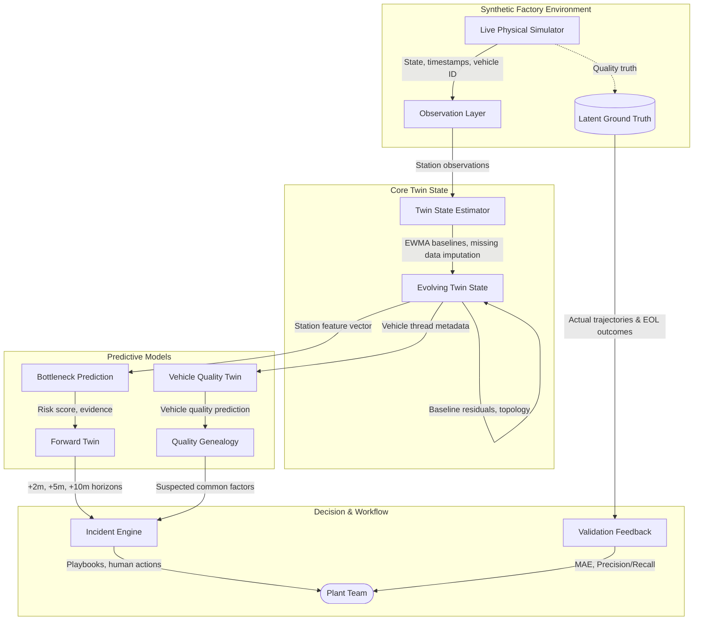

# LineLens Architecture

LineLens is an automotive digital twin prototype designed to detect production bottlenecks and vehicle quality issues earlier than traditional inspection points. It operates by observing a synthetic physical factory through simulated sensors, building a continuous twin state estimation, predicting risks using interpretable models, and generating disposable forward simulations to evaluate no-intervention impacts. The resulting insights are surfaced to human operators through an incident response workflow.

## Architecture Overview

## Synthetic Factory
LineLens uses a fast in-memory synthetic physical factory as its data source. The factory represents a simplified automotive production process consisting of 11 stations spanning 3 shops:
- **Body Shop**: Body Framing Cell, Robotic Weld Cell, Underbody Cell
- **Paint Shop**: Pretreatment Tunnel, Paint Booth, Curing Oven
- **Final Assembly**: Trim Station, Chassis Marriage, Wheel & Torque, ADAS Calibration, End-of-Line Inspection

The topology is linear and includes explicit capacity buffers like the Body Shop Exit Accumulator (capacity 4) and Painted Body Storage (capacity 5). The simulation handles varying takt times, transfer delays, physical accumulation, starvation, and blocking while managing a mixed flow of vehicle models.

## Observation Layer
The Twin does not have direct access to internal simulator state. Instead, it reads through an observation layer configured with realistic sensor maturity tiers:
- **Full Telemetry**: Direct cycle observation, PLC state, vehicle identity, and rich tool telemetry (e.g., weld energy, torque).
- **Limited Telemetry**: Entry/exit timestamps, PLC state, and conveyor occupancy; no direct cycle sensor.
- **Legacy / Basic Signals**: Basic arrival/departure events and occupancy only; cycle time must be inferred.

## Twin State Estimator
The Estimator constructs a healthy fingerprint for each station using an interpretable exponentially weighted moving average (EWMA) of cycle times, utilization, and queue levels. It applies a 3σ envelope (with a 4-second margin) to exclude extreme noise or blocked states from polluting the baseline.

The output is an evolving Twin estimate that includes cycle residuals (the difference from normal) and trend classifications (stable/rising/falling). The system maintains a bounded confidence score (0.18–0.99) that incorporates sensor maturity, signal coverage, freshness, and history depth. During data gaps, confidence decays exponentially while the system uses the last known stable state.

## Bottleneck Prediction
Bottleneck risk uses an interpretable weighted logistic score. Rather than opaque machine learning, it evaluates a deterministic feature vector (e.g., cycle-to-takt ratio, residual pressure, persistence, queue growth, utilization). The risk score predicts the likelihood of material flow disruption, translating plant evidence into severity levels (LOW, ELEVATED, HIGH, SEVERE). Risk is separate from confidence; you can have a highly confident prediction of a low risk.

## Forward Twin
When elevated bottleneck risk persists, LineLens spawns a disposable Forward Twin. The system serializes the public Twin state and runs it forward (typically for 120, 300, 600, and 900 seconds) assuming no human intervention. This deterministic clone identifies downstream starvation, upstream blocking, and throughput loss before they occur in the physical line. Forecast alerts are generated and deduplicated for these simulated impacts.

## Vehicle Quality Twin
Each vehicle maintains an in-memory digital build record summarizing its cycle times, results, and station-specific process metadata (e.g., electrode lot, robot cell, energy deviation). The Quality Predictor evaluates this thread against a trained logistic regression model to flag defect risks before End-of-Line (EOL) inspection. 

Risky vehicles are monitored dynamically. A **Quality Genealogy** analyzer continuously scans high-risk vehicle cohorts for enriched common factors—identifying suspected root causes (e.g., a specific weld gun or process parameter) by comparing feature prevalence in the affected cohort against normal baseline rates.

## Incident Engine
To support human operators, LineLens escalates persistent risks into a human-in-the-loop Incident Engine.
- **Production Incidents**: Triggered by bottleneck forecasts, providing anticipated disruption timing and affected downstream buffers.
- **Quality Incidents**: Triggered when a vehicle cohort shares a high-risk quality pattern, enabling early containment actions.

The Incident Engine provides guided playbooks and records human workflow steps (acknowledge, investigate, resolve). It never executes autonomous physical control actions.

## Validation Layer
LineLens includes real-time validation against synthetic ground truth.
- **Bottleneck Validation**: Compares early no-intervention forecasts against actual simulator trajectories (e.g., Queue MAE, Throughput MAE, Lead Time).
- **Quality Validation**: Evaluates early defect predictions against eventual EOL inspection outcomes (Precision, Recall, Lead Time), explicitly delaying measurement until ground truth is actually revealed.

## Frontend
The UI is a React 18 application using Vite and React Three Fiber (Three.js) for 3D factory visualization. The primary workspaces are:
- **Dashboard**: 3D factory view, live metrics, and station inspection.
- **Quality**: Traceable vehicle monitoring, digital build records, and genealogy analysis.
- **Incidents**: Workflow response for identified production and quality issues.

## Configuration
Station specifications, nominal takt times, incoming queue capacities, and assigned sensor maturity tiers are defined within the backend simulation engine (`backend/app/simulation.py`). The application configuration and port definitions are isolated in environment configuration logic.
